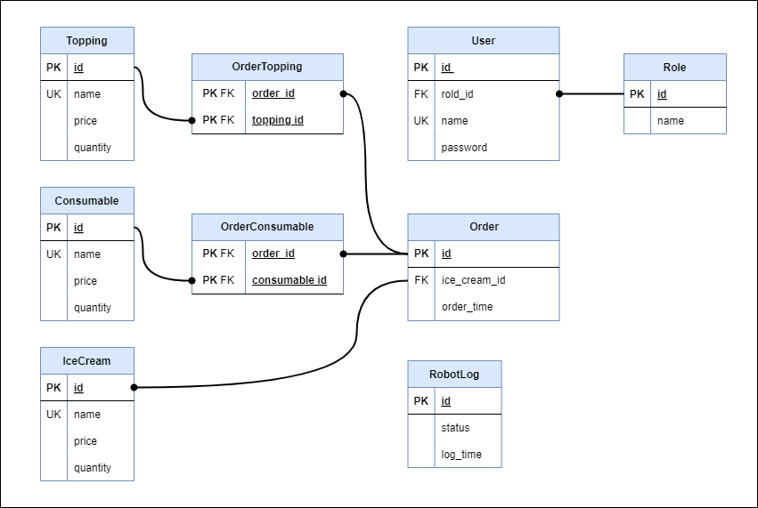

<div align=center>
  <h2>서비스 소개</h2>
  <br>
  <br>
  <br> 
  <h3>백오피스 페이지</h3>
  <b>무인 아이스크림 매장 관리 서비스</b><br>
  <br>
  매장 운영을 업그레이드해 줄 관리 시스템입니다.<br>
  실시간 데이터 분석, 통합 모니터링 등 손쉽게 서비스를 제어하고 관리할 수 있습니다.<br>
  <br>
  
  <h3>ℹ️상세페이지 <a href="https://jangjh0201.notion.site/e2b2dddc214442ad8f01406454988626?pvs=4" title="백오피스 페이지">이동</a>ℹ️</h3>
  <br>
  
  <table>
    <tr>
      <td align="center" width="33%">
        <h3>웹</h3>
        
      </td>
      <td align="center" width="33%">
        <h3>모바일</h3>
        
      </td>
    </tr>
  </table>
  
  <h3>ERD</h3>
  <br>
  <br>
  
  <h2>개발 기간</h2>
  <b>총 개발기간</b><br>
  2024/7/1 ~ 2024/8/30<br>
  <br>
  
  <h2>패키지 설치</h2>

  <div align=left>
    <b>Git clone</b>
  </div>
  
  ```
  git clone https://github.com/aris-hi5/webapp.git
  ```

  <div align=left>
    <b>의존성 설치</b>
  </div>
  
  ```
  pip install -r requirements.txt
  ```

</div>
